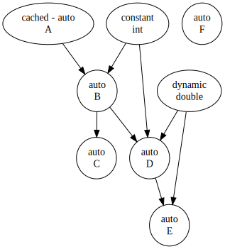

# inversify-cpp-visualizer

[](https://github.com/Mosure/inversify-cpp-visualizer/actions?query=workflow%3Aubuntu)
[](https://github.com/Mosure/inversify-cpp-visualizer/actions?query=workflow%3Amacos)
[](https://github.com/Mosure/inversify-cpp-visualizer/actions?query=workflow%3Awindows)
[](https://raw.githubusercontent.com/mosure/inversify-cpp-visualizer/main/LICENSE)
[](https://github.com/mosure/inversify-cpp-visualizer)
[](https://github.com/mosure/inversify-cpp-visualizer/issues)
[](http://isitmaintained.com/project/mosure/inversify-cpp-visualizer "Average time to resolve an issue")

inversify-cpp dependency graph export tool.



## Integration

```cpp

#include <mosure/inversify.hpp>
#include <mosure/visualizer.hpp>

// for convenience
namespace inversify = mosure::inversify;
namespace inversify_visualizer = mosure::inversify_visualizer;

```

```cpp
inversify::Container<
    symbols::foo
> container;

// ...

inversify_visualizer::write_graphviz(std::cout, container);
```

## Features
*   BUILD/WORKSPACE
*   Bazel Ubuntu, macOS, Windows workflows

## Running example
`bazel run example  --enable_platform_specific_config`
